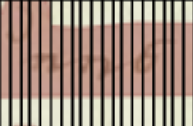
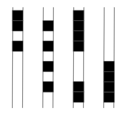
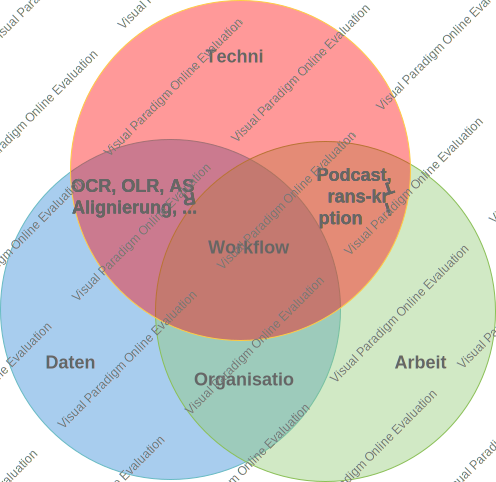

layout: true
  

  <table>
    <tr>
      <td style="text-align:right">Sächsische Landesbibliothek – Staats- und Universitätsbibliothek</td>
      <td>2. Juni 2022</td>
      <td style="text-align:right"><a href="https://www.slub-dresden.de/">www.slub-dresden.de</a></td>
    </tr>
    <tr>
      <td style="text-align:right">Referate 4.3, 2.5</td>
      <td />
    </tr>
  </table>

  <table>
    <tr>
      <td style="text-align:left"><b>Kay-Michael Würzner</b></td>
      <td style="text-align:left"><b>Robert Sachunsky</b></td>
      <td style="text-align:left"><b>Alexander Lasch</b></td>
    </tr>
    <tr>
      <td style="text-align:left">Referat 4.3</td>
      <td style="text-align:left">Referat 2.5</td>
      <td style="text-align:left">TU Dresden</td>
    </tr>
    <tr>
      <td style="font-size:8pt"><b>2. Juni 2022</b></td>
    </tr>
    <tr>
      <td style="font-size:8pt">8. Bibliothekskongress Leipzig 2022</td>
    </tr>
  </table>

---

class: title-slide
count: false

# Verbesserung automatischer Handschrifterkennung durch bürgerwissenschaftliche Transkription

---

# Überblick

- Prinzipien der Handschriftenerkennung

- Beteiligungskulturen

- Diskussion

---

class: part-slide
count: false

# Prinzipien der Handschriftenerkennung

- Wie funktioniert's?
- Datengetriebene Erkennungsmodelle
- Vergleich mit Texterkennung von Drucken
- Anforderungen an Trainingsdaten

---

## Wie funktioniert's?

- Ziel: Transformation von Bilddaten in maschinenlesbaren Volltext
    + schrittweise Verarbeitung

↓

oberwähntem Tage mancher sorgliche Gedanke auf, 
&amp; wir seufzten öfters zum Heiland, daß Er uns 
vor allem Schaden, der uns etwa in der folgen- 
den Nacht begegnen könnte, in Gnaden bewahren

---

## Wie funktioniert's?

- Schritt 1: Zeilenerkennung
    + **regelbasierte** (Bildmorphologie) oder
    + **datengetriebene** Verfahren (e.g. Pixelklassifikation)

↓

---

## Wie funktioniert's?

- Schritt 2: Vektorisierung
    + **Skalierung** auf einheitliche Höhe
    + **Unterteilung** in 1 Pixel breite Streifen

↓

---

## Wie funktioniert's?

- Schritt 3: Zeichenerkennung
    + **Übergangswahrscheinlichkeiten** zwischen Vektoren
    + Rückgriff auf (vorab) trainiertes **Modell**

↓

oberwähntem Tage mancher sorgliche Gedanke auf, 
&amp; wir seufzten öfters zum Heiland, daß Er uns 
vor allem Schaden, der uns etwa in der folgen- 
den Nacht begegnen könnte, in Gnaden bewahren

---

## Datengetriebene Erkennungsmodelle

.cols[
.sixty[
- Tabellen mit fester Anzahl Zeilen  
  und mit variabler Anzahl Spalten
- Pixelspalten als Vektorfolge
  + charakteristische Abfolge pro Zeichen
+ Vektor-Übergangswahrscheinlichkeiten = **trainierbares Modell**
]
.fourty[

↓

]
]

---

## Vergleich mit Texterkennung von Drucken

- einheitliches Paradigma für automatische Erkennung  
  von Handschrift und Druck (und Noten etc.)
  + Training: auf Zeilenebene zugeordnete Bild-Text-Paare
- jedoch höhere Varianz bei Handschriften…
  + Gestalt (Hand vs. Schriftart)
  + Materialität (Stift, Feder, Papier, Presse)
  + Aufwand (Notiz, Brief, Zeitung, Festschrift ...)

---

## Anforderungen an Trainingsdaten

- Quantität
  + größere Menge an Trainingsdaten (intra-individuelle Varianz)
  + schlechtere Übertragbarkeit trainierter Modelle (inter-individuelle Varianz)
- Qualität
  + (teilweise) schwerer zu lesendes Ausgangsmaterial
  + komplexe Aufbereitung für Training wegen aufwendigerer Segmentierung

Einblick [LAREX](https://ocr.slub-dresden.de/Larex/)

---

class: part-slide
count: false

# Beteiligungskulturen

- Motivation
- Szenarien der Einbindung externer Kompetenzen
- Schlussfolgerungen

---

## Motivation

- benötigte softwaretechnische Umgebung **frei verfügbar**
- **manuelle** Aufwände (und Kosten) i.A. nicht abbildbar
- Freiwillige unterstützen bei Erstellung von Trainingsdaten

---

## Szenarien der Einbindung externer Kompetenzen

<!-- Workflow-Aspekte -->

- Workflow / Arbeitsteilung
- Sichtbarkeit und Interesse
- Beitrag durch Freiwillige
- technische Unterstützung bei manueller Arbeit
- technische Unterstützung durch automatische Schritte

<!-- ff. am konkreten Beispiel: -->

---

### Bsp. Soldatenbriefe 1871

- Dissertationsprojekt Soldatenbriefe Deutsch-Französischer Krieg 1870/71 (Dominik Hetjens, TU Dresden)
- Zufallsfund: bürgerwissenschaftliche Edition

---

### Exkurs: Herrnhut Digital

---

### Bsp. Herrnhut Digital: digit. Ed.

- Ehrenamtsprojekt *Gemeinnachrichten* (Leitung: Juan Garcés)
- Kurrent- und Editionsvermittlung

---

### Bsp. Herrnhut Digital: Podcast

- Podcast [*Alte Schriften*](https://open.spotify.com/show/4DFXzITmsHlJiwC3OsRp5l?si=_9OJbAc_TFeceTFvxzuGSA)
- „Retextualisierung“ mittels automatischer Spracherkennung

---

## Schlussfolgerungen

- Zielkonflikt:
  + Domänenexpertise (Kurrent, Hintergrundwissen) vs.
  + rechentechnische Fertigkeiten

  → Vermeidung durch Etablierung geteilter Arbeitsabläufe

- Reduktion technischer Hürden und manuellen Aufwands:
  + Transkription _ohne_ manuelle Segmentierung
  + dafür automatisch: OLR und Alignierung von OCR und Transkription

<!-- Überbrückung der Segmentierung -->
<!-- Kompromiss zwischen Aufwand für weitestmögliche Automatisierung und Umfang der manuellen Nachbearbeitung -->

---

class: part-slide
count: false

# Diskussion

- Rolle der Bibliotheken
- Bürgerwissenschaft

---

## Rolle der Bibliotheken

- auf allen Seiten…
  + Kompetenzen
  + Interesse
  + Wertschöpfung als gemeinsames Ziel
- wissenschaftliche Bibliothek als…
  + Anbieter & Sammler von (Werk-)Daten
  + Vermittler (Zugang, Organisation, Wissen, Forschung)
  + technische Infrastruktur (Informationsdienste, Erschließung/Präsentation, Digitalisierung, Weiterentwicklung)

---

## Bürgerwissenschaftliche Beteiligung

- im Zuge freiwilligen Engagements
    + aus Interesse an spezifischen Inhalten
        * z.B. Geschichtsvereine
    + aus Interesse an der Sache
        * z.B. Ehrenamt an der SLUB
    + Einbindung spezieller Kompetenz
        * z.B. Kurrentkundige, Genealogie
- bisher nur in der „Forschungsvorbereitung“
    + Hilfe bei Datenerfassung und Aufbereitung
- **nächster Schritt**: gemeinsame Beforschung entstehender Daten
    + Kompetenzvermittlung auch über unseren Nutzen hinaus
        * z.B. Seniorenakademie

---

class: part-slide

# Danke für Ihre Aufmerksamkeit!

<a href="https://wrznr.github.io/bibliothekskongress-2022/">wrznr.github.io/bibliothekskongress-2022</a>

