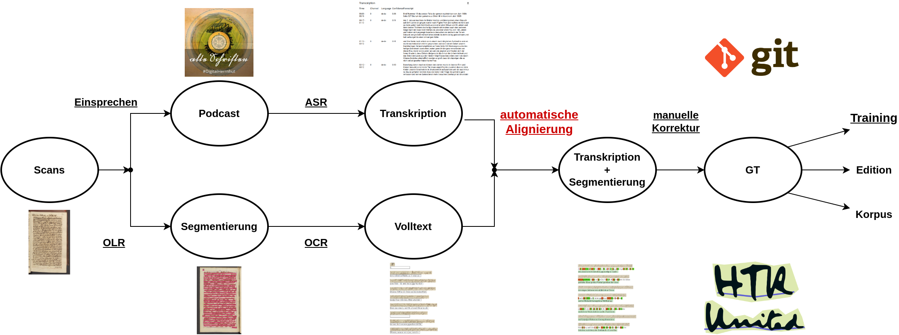

layout: true
  

  <table>
    <tr>
      <td style="text-align:right">Sächsische Landesbibliothek – Staats- und Universitätsbibliothek</td>
      <td>2. Juni 2022</td>
      <td style="text-align:right"><a href="https://www.slub-dresden.de/">www.slub-dresden.de</a></td>
    </tr>
    <tr>
      <td style="text-align:right">Referate 4.3, 2.5</td>
      <td />
    </tr>
  </table>

  <table>
    <tr>
      <td style="text-align:left"><b>Kay-Michael Würzner</b></td>
      <td style="text-align:left"><b>Robert Sachunsky</b></td>
      <td style="text-align:left"><b>Alexander Lasch</b></td>
    </tr>
    <tr>
      <td style="text-align:left">Referat 4.3</td>
      <td style="text-align:left">Referat 2.5</td>
      <td style="text-align:left">TU Dresden</td>
    </tr>
    <tr>
      <td style="font-size:8pt"><b>2. Juni 2022</b></td>
    </tr>
    <tr>
      <td style="font-size:8pt">8. Bibliothekskongress Leipzig 2022</td>
    </tr>
  </table>

---

class: title-slide
count: false

# Verbesserung automatischer Handschriftenerkennung durch bürgerwissenschaftliche Transkription

---

# Überblick

- Prinzipien der Handschriftenerkennung
  + Datengetriebene Erkennungsmodelle
  + Vergleich mit Texterkennung von Drucken
  + Anforderungen an Trainingsdaten
- Beteiligungskultur(en)
  + Motivation und Motive
  + Szenarien der Einbindung bürgerwissenschaftlicher Kompetenzen
- **Diskussion:** wissenschaftliche Bibliotheken und bürgerwissenschaftlicher Beteiligung

---

class: part-slide
count: false

# Prinzipien der Handschriftenerkennung

---

# Wie funktioniert's?

- Ziel: Transformation von Bilddaten in maschinenlesbaren Volltext
    + schrittweise Verarbeitung

↓

oberwähntem Tage mancher sorgliche Gedanke auf, 
&amp; wir seufzten öfters zum Heiland, daß Er uns 
vor allem Schaden, der uns etwa in der folgen- 
den Nacht begegnen könnte, in Gnaden bewahren

---

# Wie funktioniert's?

- Schritt 1: Zeilenerkennung
    + **regelbasierte** (Bildmorphologie) oder
    + **datengetriebene** Verfahren (e.g. Pixelklassifikation)

↓

---

# Wie funktioniert's?

- Schritt 2: Vektorisierung
    + **Skalierung** auf einheitliche Höhe
    + **Unterteilung** in 1pixel-breite Streifen

↓

---

# Wie funktioniert's?

- Schritt 3: Textermittlung
    + **Übergangswahrscheinlichkeiten** zwischen Vektoren
    + Rückgriff auf (offline) trainiertes **Modell**

↓

oberwähntem Tage mancher sorgliche Gedanke auf, 
&amp; wir seufzten öfters zum Heiland, daß Er uns 
vor allem Schaden, der uns etwa in der folgen- 
den Nacht begegnen könnte, in Gnaden bewahren

---

# Datengetriebene Erkennungsmodelle

.cols[
.sixty[
- Tabelle mit fester Anzahl Zeilen und variabler Anzahl Spalten
- Pixelspalten als Vektorfolge
  + charakteristische Abfolge pro Zeichen (und Wort)
+ **Übergangswahrscheinlichkeiten** zwischen Vektoren = trainierbares Modell
]
.fourty[

↓

]
]

---

# Vergleich mit Texterkennung von Drucken

- gemeinsames Paradigma für Erkennung von Handschriften und Drucken (und Noten etc.)
  + Training: auf Zeilenebene alignierte Bild- und (fehlerfreie) Textdaten
- jedoch höhere Varianz bei Handschriften
  + Gestalt (Hand vs. Schriftart)
  + Materialität (Stift,Feder, Papier)
  + Aufwand (Notiz, Brief, Zeitung, Festschrift ...)

---

# Anforderungen an Trainingsdaten

- Quantität
  + größere Menge an Trainingsdaten (intraindividuelle Varianz)
  + schlechtere Übertragbarkeit trainierter Modelle (interindividuelle Varianz)
- Qualität
  + (teilweise) schwerer zu lesendes Ausgangsmaterial
  + komplexere Aufbereitung für Training durch aufwändigere Segmentierung

ANIMATION

---

class: part-slide
count: false

# Beteiligungskultur(en)

---

# Beteiligungskultur(en)

- benötigte softwaretechnische Umgebung **frei verfügbar**
- manuelle Aufwände (und Kosten) im Allgemeinen nicht abbildbar
- Unterstützung der Trainingsmaterialerstellung durch Freiwillige

VENN-DIAGRAMM

---

class: part-slide
count: false

# Szenarien der Einbindung bürgerwissenschaftlicher Kompetenzen

---

# Soldatenbriefe

---

# Exkurs: Herrnhut Digital

---

# Nachrichten aus der Brüdergemeine: digitale Ed.

---

# Nachrichten aus der Brüdergemeine: Podcast

---

# Folgerung

- Zielkonflikt
  + Domänenexpertise (Kurrent) vs.
  + informationstechnische Fertigkeiten
- Verringerung der Distanz durch Etablierung einfacher(er) Arbeitsabläufe
  + Überbrückung der manuellen Segmentierung via OLR durch automatisierte Alignierung von Transkription und OCR

Kompromiss zwischen Aufwänden für weitestmögliche Automatisierung und Umfang der manuellen Nachbearbeitung

---

class: part-slide
count: false

# Wissenschaftliche Bibliotheken und bürgerwissenschaftliche Beteiligung

---

class: part-slide

# Many thanks for your attention!

<a href="https://wrznr.github.io/bibliothekskongress-2022/">wrznr.github.io/bibliothekskongress-2022</a>

